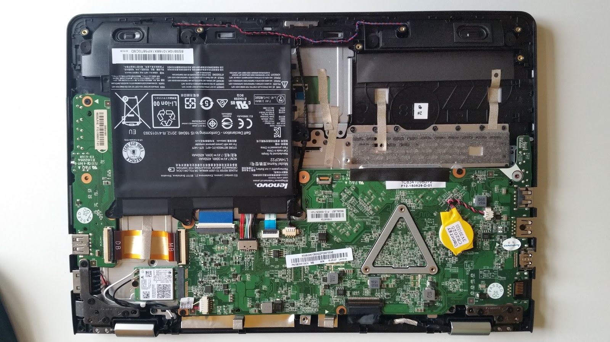

*This was originally posted on blogger [here](https://snarkybrill.blogspot.com/2016/01/linux-lenovo-yoga-300-11ibr.html)*.

In the previous post I ranted about the utter ignorance, carelessness and windows-centredness of HP, which is unable to provide compatible ACPI and decided to put there some unknown I2C codec that even google or worse baidu haven't heard about when I tried to type the chip markings there. So I gave up and sold the Windows-only HP Pavilion X2 laptop to a friend who does not mind this crap OS.

And I have new and shining Lenovo Yoga 300-11IBR. It is slightly larger, heavier and has shorter battery life than the HP Pavilion X2 and it has standard 45W power brick while HP had nice tiny tablet charger with USB-C connector. But anyway, Lenovo runs Linux without problems... Well, at least without unbearable problems.

Before proceeding further there are some photos:


And insides:



There is no fan (sweet) and there is even a place for thin 2.5'' disc, but special bracket and a cable is needed. (I have eMMC version with 64 GB and I am fine with that.)

OK, so what's the status with Linux. I tried this puppy with Ubuntu 15.10 and it worked out of box. Touchscreen, graphics, touchpad, camera, power indicator, sound, everything seems to be doing fine. But... I noticed some problems with ACPI after a while: Special keys, like volume + / - (physical), screen brightness + / - (virtual) seems not to be working or working with unpredictable delay. Software applets for manipulating volume and brightness works for me, so it is not a show stopper. And the same observation fits to ACPI events like AC adapter inserted or removed - there is huge delay, like tens of seconds or minute. And the same for LID close event. And the orientation sensor seems not to be supported - there is some ugly error in dmesg that concerns probing it. But I am using the laptop as a laptop so I do not care about the sensor much.

But anyway, the ACPI events problem might get solved in some BIOS update or there might be a solution in rewriting DSDT table. I dind't have enough time to dig deeper so far.

I am attaching dmesg and dmidecode outputs here.

## dmesg

```
[    0.000000] Initializing cgroup subsys cpuset
[    0.000000] Initializing cgroup subsys cpu
[    0.000000] Initializing cgroup subsys cpuacct
[    0.000000] Linux version 4.4.0-rc8 (brill@hroch) (gcc version 5.2.1 20151010 (Ubuntu 5.2.1-22ubuntu2) ) #1 SMP Tue Jan 5 17:25:05 CET 2016
[    0.000000] Command line: BOOT_IMAGE=/@/boot/vmlinuz-4.4.0-rc8 root=UUID=051eb2d7-2358-402b-a87c-8d7067c37512 ro rootflags=subvol=@
[    0.000000] KERNEL supported cpus:
[    0.000000]   Intel GenuineIntel
[    0.000000]   AMD AuthenticAMD
[    0.000000]   Centaur CentaurHauls
[    0.000000] x86/fpu: Legacy x87 FPU detected.
[    0.000000] x86/fpu: Using 'lazy' FPU context switches.
[    0.000000] e820: BIOS-provided physical RAM map:
[    0.000000] BIOS-e820: [mem 0x0000000000000000-0x000000000006efff] usable
[    0.000000] BIOS-e820: [mem 0x000000000006f000-0x000000000006ffff] ACPI NVS
[    0.000000] BIOS-e820: [mem 0x0000000000070000-0x0000000000085fff] usable
[    0.000000] BIOS-e820: [mem 0x0000000000086000-0x000000000009ffff] reserved
[    0.000000] BIOS-e820: [mem 0x0000000000100000-0x000000001fffffff] usable
[    0.000000] BIOS-e820: [mem 0x0000000020000000-0x00000000201fffff] reserved
[    0.000000] BIOS-e820: [mem 0x0000000020200000-0x0000000079b23fff] usable
[    0.000000] BIOS-e820: [mem 0x0000000079b24000-0x0000000079d23fff] type 20
[    0.000000] BIOS-e820: [mem 0x0000000079d24000-0x000000007a523fff] reserved
[    0.000000] BIOS-e820: [mem 0x000000007a524000-0x000000007a723fff] ACPI NVS
[    0.000000] BIOS-e820: [mem 0x000000007a724000-0x000000007a763fff] ACPI data
[    0.000000] BIOS-e820: [mem 0x000000007a764000-0x000000007b374fff] usable
[    0.000000] BIOS-e820: [mem 0x000000007b375000-0x000000007bd74fff] reserved
[    0.000000] BIOS-e820: [mem 0x000000007bd75000-0x000000007bffffff] usable
[    0.000000] BIOS-e820: [mem 0x00000000e00f8000-0x00000000e00f8fff] reserved
[    0.000000] BIOS-e820: [mem 0x00000000fed01000-0x00000000fed01fff] reserved
[    0.000000] BIOS-e820: [mem 0x00000000ffc00000-0x00000000ffffffff] reserved
[    0.000000] NX (Execute Disable) protection: active
[    0.000000] efi: EFI v2.40 by INSYDE Corp.
[    0.000000] efi:  ACPI 2.0=0x7a763014  SMBIOS=0x79eb3000  ESRT=0x79eb7618 
[    0.000000] esrt: Reserving ESRT space from 0x0000000079eb7618 to 0x0000000079eb7650.
[    0.000000] SMBIOS 2.8 present.
[    0.000000] DMI: LENOVO 80M1/Mini, BIOS C7CN24WW 08/11/2015
[    0.000000] e820: update [mem 0x00000000-0x00000fff] usable ==&gt; reserved
[    0.000000] e820: remove [mem 0x000a0000-0x000fffff] usable
[    0.000000] e820: last_pfn = 0x7c000 max_arch_pfn = 0x400000000
[    0.000000] MTRR default type: uncachable
[    0.000000] MTRR fixed ranges enabled:
[    0.000000]   00000-9FFFF write-back
[    0.000000]   A0000-FFFFF write-protect
[    0.000000] MTRR variable ranges enabled:
[    0.000000]   0 base 0FFC00000 mask FFFC00000 write-protect
[    0.000000]   1 base 000000000 mask F80000000 write-back
[    0.000000]   2 base 07C000000 mask FFC000000 uncachable
[    0.000000]   3 disabled
[    0.000000]   4 disabled
[    0.000000]   5 disabled
[    0.000000]   6 disabled
[    0.000000]   7 disabled
[    0.000000] x86/PAT: Configuration [0-7]: WB  WC  UC- UC  WB  WC  UC- WT  
[    0.000000] Scanning 1 areas for low memory corruption
[    0.000000] Base memory trampoline at [ffff88000007c000] 7c000 size 24576
[    0.000000] BRK [0x031f9000, 0x031f9fff] PGTABLE
[    0.000000] BRK [0x031fa000, 0x031fafff] PGTABLE
[    0.000000] BRK [0x031fb000, 0x031fbfff] PGTABLE
[    0.000000] BRK [0x031fc000, 0x031fcfff] PGTABLE
[    0.000000] BRK [0x031fd000, 0x031fdfff] PGTABLE
[    0.000000] BRK [0x031fe000, 0x031fefff] PGTABLE
[    0.000000] RAMDISK: [mem 0x33f7a000-0x35fb4fff]
[    0.000000] ACPI: Early table checksum verification disabled
[    0.000000] ACPI: RSDP 0x000000007A763014 000024 (v02 LENOVO)
[    0.000000] ACPI: XSDT 0x000000007A763120 0000AC (v01 LENOVO CB-01    00000003      01000013)
[    0.000000] ACPI: FACP 0x000000007A75D000 00010C (v05 LENOVO CB-01    00000003 ACPI 00040000)
[    0.000000] ACPI: DSDT 0x000000007A74B000 00DC1E (v02 LENOVO CB-01    00000003 ACPI 00040000)
[    0.000000] ACPI: FACS 0x000000007A710000 000040
[    0.000000] ACPI: UEFI 0x000000007A762000 000236 (v01 LENOVO CB-01    00000001 ACPI 00040000)
[    0.000000] ACPI: TCPA 0x000000007A760000 000032 (v02 LENOVO CB-01    00000000 ACPI 00040000)
[    0.000000] ACPI: MSDM 0x000000007A75F000 000055 (v03 LENOVO CB-01    00000001 ACPI 00040000)
[    0.000000] ACPI: UEFI 0x000000007A75E000 000042 (v01 LENOVO CB-01    00000000 ACPI 00040000)
[    0.000000] ACPI: APIC 0x000000007A75C000 000084 (v03 LENOVO CB-01    00000003 ACPI 00040000)
[    0.000000] ACPI: MCFG 0x000000007A75B000 00003C (v01 LENOVO CB-01    00000003 ACPI 00040000)
[    0.000000] ACPI: SSDT 0x000000007A75A000 0005F3 (v01 INSYDE CpuDptf  00000003 ACPI 00040000)
[    0.000000] ACPI: SSDT 0x000000007A759000 00071A (v01 INSYDE DptfTab  00000003 ACPI 00040000)
[    0.000000] ACPI: SSDT 0x000000007A74A000 000763 (v01 INSYDE CpuPm    00003000 ACPI 00040000)
[    0.000000] ACPI: SSDT 0x000000007A749000 000290 (v01 INSYDE Cpu0Tst  00003000 ACPI 00040000)
[    0.000000] ACPI: SSDT 0x000000007A748000 00017A (v01 INSYDE ApTst    00003000 ACPI 00040000)
[    0.000000] ACPI: SSDT 0x000000007A747000 000432 (v01 INSYDE Tpm2Tabl 00001000 ACPI 00040000)
[    0.000000] ACPI: TPM2 0x000000007A746000 000034 (v03 LENOVO CB-01    00000000 ACPI 00040000)
[    0.000000] ACPI: SLIC 0x000000007A761000 000176 (v01 LENOVO CB-01    00000001 ACPI 00040000)
[    0.000000] ACPI: FPDT 0x000000007A745000 000044 (v01 LENOVO CB-01    00000002 ACPI 00040000)
[    0.000000] ACPI: BGRT 0x000000007A744000 000038 (v01 LENOVO CB-01    00000001 ACPI 00040000)
[    0.000000] ACPI: Local APIC address 0xfee00000
[    0.000000] No NUMA configuration found
[    0.000000] Faking a node at [mem 0x0000000000000000-0x000000007bffffff]
[    0.000000] NODE_DATA(0) allocated [mem 0x7978a000-0x7978dfff]
[    0.000000] Zone ranges:
[    0.000000]   DMA      [mem 0x0000000000001000-0x0000000000ffffff]
[    0.000000]   DMA32    [mem 0x0000000001000000-0x000000007bffffff]
[    0.000000]   Normal   empty
[    0.000000] Movable zone start for each node
[    0.000000] Early memory node ranges
[    0.000000]   node   0: [mem 0x0000000000001000-0x000000000006efff]
[    0.000000]   node   0: [mem 0x0000000000070000-0x0000000000085fff]
[    0.000000]   node   0: [mem 0x0000000000100000-0x000000001fffffff]
[    0.000000]   node   0: [mem 0x0000000020200000-0x0000000079b23fff]
[    0.000000]   node   0: [mem 0x000000007a764000-0x000000007b374fff]
[    0.000000]   node   0: [mem 0x000000007bd75000-0x000000007bffffff]
[    0.000000] Initmem setup node 0 [mem 0x0000000000001000-0x000000007bffffff]
[    0.000000] On node 0 totalpages: 501572
[    0.000000]   DMA zone: 64 pages used for memmap
[    0.000000]   DMA zone: 22 pages reserved
[    0.000000]   DMA zone: 3972 pages, LIFO batch:0
[    0.000000]   DMA32 zone: 7872 pages used for memmap
[    0.000000]   DMA32 zone: 497600 pages, LIFO batch:31
[    0.000000] Reserving Intel graphics stolen memory at 0x7ce00000-0x7edfffff
[    0.000000] ACPI: PM-Timer IO Port: 0x408
[    0.000000] ACPI: Local APIC address 0xfee00000
[    0.000000] ACPI: LAPIC_NMI (acpi_id[0x01] high level lint[0x1])
[    0.000000] ACPI: LAPIC_NMI (acpi_id[0x02] high level lint[0x1])
[    0.000000] ACPI: LAPIC_NMI (acpi_id[0x03] high level lint[0x1])
[    0.000000] ACPI: LAPIC_NMI (acpi_id[0x04] high level lint[0x1])
[    0.000000] IOAPIC[0]: apic_id 1, version 32, address 0xfec00000, GSI 0-114
[    0.000000] ACPI: INT_SRC_OVR (bus 0 bus_irq 0 global_irq 2 dfl dfl)
[    0.000000] ACPI: INT_SRC_OVR (bus 0 bus_irq 9 global_irq 9 high level)
[    0.000000] ACPI: IRQ0 used by override.
[    0.000000] ACPI: IRQ9 used by override.
[    0.000000] Using ACPI (MADT) for SMP configuration information
[    0.000000] smpboot: Allowing 4 CPUs, 0 hotplug CPUs
[    0.000000] PM: Registered nosave memory: [mem 0x00000000-0x00000fff]
[    0.000000] PM: Registered nosave memory: [mem 0x0006f000-0x0006ffff]
[    0.000000] PM: Registered nosave memory: [mem 0x00086000-0x0009ffff]
[    0.000000] PM: Registered nosave memory: [mem 0x000a0000-0x000fffff]
[    0.000000] PM: Registered nosave memory: [mem 0x20000000-0x201fffff]
[    0.000000] PM: Registered nosave memory: [mem 0x79b24000-0x79d23fff]
[    0.000000] PM: Registered nosave memory: [mem 0x79d24000-0x7a523fff]
[    0.000000] PM: Registered nosave memory: [mem 0x7a524000-0x7a723fff]
[    0.000000] PM: Registered nosave memory: [mem 0x7a724000-0x7a763fff]
[    0.000000] PM: Registered nosave memory: [mem 0x7b375000-0x7bd74fff]
[    0.000000] e820: [mem 0x7ee00000-0xe00f7fff] available for PCI devices
[    0.000000] Booting paravirtualized kernel on bare hardware
[    0.000000] clocksource: refined-jiffies: mask: 0xffffffff max_cycles: 0xffffffff, max_idle_ns: 7645519600211568 ns
[    0.000000] setup_percpu: NR_CPUS:256 nr_cpumask_bits:256 nr_cpu_ids:4 nr_node_ids:1
[    0.000000] PERCPU: Embedded 33 pages/cpu @ffff880079400000 s97496 r8192 d29480 u524288
[    0.000000] pcpu-alloc: s97496 r8192 d29480 u524288 alloc=1*2097152
[    0.000000] pcpu-alloc: [0] 0 1 2 3 
[    0.000000] Built 1 zonelists in Node order, mobility grouping on.  Total pages: 493614
[    0.000000] Policy zone: DMA32
[    0.000000] Kernel command line: BOOT_IMAGE=/@/boot/vmlinuz-4.4.0-rc8 root=UUID=051eb2d7-2358-402b-a87c-8d7067c37512 ro rootflags=subvol=@
[    0.000000] PID hash table entries: 4096 (order: 3, 32768 bytes)
[    0.000000] Calgary: detecting Calgary via BIOS EBDA area
[    0.000000] Calgary: Unable to locate Rio Grande table in EBDA - bailing!
[    0.000000] Memory: 1887208K/2006288K available (8299K kernel code, 1269K rwdata, 3980K rodata, 1464K init, 1292K bss, 119080K reserved, 0K cma-reserved)
[    0.000000] SLUB: HWalign=64, Order=0-3, MinObjects=0, CPUs=4, Nodes=1
[    0.000000] Hierarchical RCU implementation.
[    0.000000]  Build-time adjustment of leaf fanout to 64.
[    0.000000]  RCU restricting CPUs from NR_CPUS=256 to nr_cpu_ids=4.
[    0.000000] RCU: Adjusting geometry for rcu_fanout_leaf=64, nr_cpu_ids=4
[    0.000000] NR_IRQS:16640 nr_irqs:1024 16
[    0.000000] Console: colour dummy device 80x25
[    0.000000] console [tty0] enabled
[    0.000000] tsc: PIT calibration matches PMTIMER. 1 loops
[    0.000000] tsc: Detected 1600.004 MHz processor
[    0.000056] Calibrating delay loop (skipped), value calculated using timer frequency.. 3200.00 BogoMIPS (lpj=6400016)
[    0.000076] pid_max: default: 32768 minimum: 301
[    0.000099] ACPI: Core revision 20150930
[    0.046892] ACPI: 7 ACPI AML tables successfully acquired and loaded
[    0.048640] Security Framework initialized
[    0.048660] Yama: becoming mindful.
[    0.048686] AppArmor: AppArmor initialized
[    0.049041] Dentry cache hash table entries: 262144 (order: 9, 2097152 bytes)
[    0.050259] Inode-cache hash table entries: 131072 (order: 8, 1048576 bytes)
[    0.050820] Mount-cache hash table entries: 4096 (order: 3, 32768 bytes)
[    0.050843] Mountpoint-cache hash table entries: 4096 (order: 3, 32768 bytes)
[    0.051299] Initializing cgroup subsys io
[    0.051320] Initializing cgroup subsys memory
[    0.051343] Initializing cgroup subsys devices
[    0.051357] Initializing cgroup subsys freezer
[    0.051369] Initializing cgroup subsys net_cls
[    0.051380] Initializing cgroup subsys perf_event
[    0.051394] Initializing cgroup subsys net_prio
[    0.051407] Initializing cgroup subsys hugetlb
[    0.051423] Initializing cgroup subsys pids
[    0.051461] CPU: Physical Processor ID: 0
[    0.051470] CPU: Processor Core ID: 0
[    0.051483] ENERGY_PERF_BIAS: Set to 'normal', was 'performance'
[    0.051492] ENERGY_PERF_BIAS: View and update with x86_energy_perf_policy(8)
[    0.056946] mce: CPU supports 6 MCE banks
[    0.056968] CPU0: Thermal monitoring enabled (TM1)
[    0.056980] process: using mwait in idle threads
[    0.056992] Last level iTLB entries: 4KB 48, 2MB 0, 4MB 0
[    0.057002] Last level dTLB entries: 4KB 256, 2MB 16, 4MB 16, 1GB 0
[    0.057494] Freeing SMP alternatives memory: 28K (ffffffff820ad000 - ffffffff820b4000)
[    0.065291] ftrace: allocating 31468 entries in 123 pages
[    0.090636] ..TIMER: vector=0x30 apic1=0 pin1=2 apic2=-1 pin2=-1
[    0.130372] TSC deadline timer enabled
[    0.130380] smpboot: CPU0: Intel(R) Celeron(R) CPU  N3150  @ 1.60GHz (family: 0x6, model: 0x4c, stepping: 0x3)
[    0.130466] Performance Events: PEBS fmt2+, 8-deep LBR, Silvermont events, full-width counters, Intel PMU driver.
[    0.130505] ... version:                3
[    0.130513] ... bit width:              40
[    0.130522] ... generic registers:      2
[    0.130529] ... value mask:             000000ffffffffff
[    0.130538] ... max period:             000000ffffffffff
[    0.130546] ... fixed-purpose events:   3
[    0.130553] ... event mask:             0000000700000003
[    0.132335] x86: Booting SMP configuration:
[    0.132351] .... node  #0, CPUs:      #1
[    0.140170] NMI watchdog: enabled on all CPUs, permanently consumes one hw-PMU counter.
[    0.140468]  #2 #3
[    0.155854] x86: Booted up 1 node, 4 CPUs
[    0.155871] smpboot: Total of 4 processors activated (12800.03 BogoMIPS)
[    0.156986] devtmpfs: initialized
[    0.165520] evm: security.selinux
[    0.165532] evm: security.SMACK64
[    0.165539] evm: security.SMACK64EXEC
[    0.165547] evm: security.SMACK64TRANSMUTE
[    0.165554] evm: security.SMACK64MMAP
[    0.165562] evm: security.ima
[    0.165570] evm: security.capability
[    0.165736] PM: Registering ACPI NVS region [mem 0x0006f000-0x0006ffff] (4096 bytes)
[    0.165752] PM: Registering ACPI NVS region [mem 0x7a524000-0x7a723fff] (2097152 bytes)
[    0.166015] clocksource: jiffies: mask: 0xffffffff max_cycles: 0xffffffff, max_idle_ns: 7645041785100000 ns
[    0.166233] pinctrl core: initialized pinctrl subsystem
[    0.166531] RTC time: 18:59:18, date: 01/22/16
[    0.166892] NET: Registered protocol family 16
[    0.176593] cpuidle: using governor ladder
[    0.188601] cpuidle: using governor menu
[    0.188616] PCCT header not found.
[    0.188780] ACPI FADT declares the system doesn't support PCIe ASPM, so disable it
[    0.188797] ACPI: bus type PCI registered
[    0.188808] acpiphp: ACPI Hot Plug PCI Controller Driver version: 0.5
[    0.188992] PCI: MMCONFIG for domain 0000 [bus 00-3f] at [mem 0xe0000000-0xe3ffffff] (base 0xe0000000)
[    0.189011] PCI: not using MMCONFIG
[    0.189020] PCI: Using configuration type 1 for base access
[    0.209632] ACPI: Added _OSI(Module Device)
[    0.209646] ACPI: Added _OSI(Processor Device)
[    0.209655] ACPI: Added _OSI(3.0 _SCP Extensions)
[    0.209663] ACPI: Added _OSI(Processor Aggregator Device)
[    0.217269] [Firmware Bug]: ACPI: BIOS _OSI(Linux) query ignored
[    0.217353] ACPI Error: No handler for Region [ECRM] (ffff8800758ac1f8) [EmbeddedControl] (20150930/evregion-163)
[    0.217377] ACPI Error: Region EmbeddedControl (ID=3) has no handler (20150930/exfldio-297)
[    0.217402] ACPI Error: Method parse/execution failed [\_SB.PCI0.LPCB.H_EC._REG] (Node ffff8800758ae988), AE_NOT_EXIST (20150930/psparse-542)
[    0.233257] ACPI: Dynamic OEM Table Load:
[    0.233286] ACPI: SSDT 0xFFFF88007516D800 000613 (v01 PmRef  Cpu0Ist  00003000 INTL 20130117)
[    0.235150] ACPI: Dynamic OEM Table Load:
[    0.235171] ACPI: SSDT 0xFFFF88007535D400 000357 (v01 PmRef  Cpu0Cst  00003001 INTL 20130117)
[    0.237883] ACPI: Dynamic OEM Table Load:
[    0.237904] ACPI: SSDT 0xFFFF880075390400 00015F (v01 PmRef  ApIst    00003000 INTL 20130117)
[    0.239627] ACPI: Dynamic OEM Table Load:
[    0.239647] ACPI: SSDT 0xFFFF88007533DD80 00008D (v01 PmRef  ApCst    00003000 INTL 20130117)
[    0.244197] ACPI : EC: EC started
[    0.468046] ACPI: Interpreter enabled
[    0.468073] ACPI Exception: AE_NOT_FOUND, While evaluating Sleep State [\_S1_] (20150930/hwxface-580)
[    0.468098] ACPI Exception: AE_NOT_FOUND, While evaluating Sleep State [\_S2_] (20150930/hwxface-580)
[    0.468157] ACPI: (supports S0 S3 S4 S5)
[    0.468167] ACPI: Using IOAPIC for interrupt routing
[    0.468282] PCI: MMCONFIG for domain 0000 [bus 00-3f] at [mem 0xe0000000-0xe3ffffff] (base 0xe0000000)
[    0.472593] PCI: MMCONFIG at [mem 0xe0000000-0xe3ffffff] reserved in ACPI motherboard resources
[    0.472631] PCI: Using host bridge windows from ACPI; if necessary, use "pci=nocrs" and report a bug
[    0.495249] ACPI: Power Resource [USBC] (on)
[    0.507407] ACPI: Power Resource [CLK0] (on)
[    0.508623] ACPI: Power Resource [CLK0] (on)
[    0.508758] ACPI: Power Resource [CLK1] (on)
[    0.518051] ACPI: Power Resource [ID3C] (off)
[    0.527748] ACPI: PCI Root Bridge [PCI0] (domain 0000 [bus 00-ff])
[    0.527777] acpi PNP0A08:00: _OSC: OS supports [ExtendedConfig ASPM ClockPM Segments MSI]
[    0.527972] \_SB_.PCI0:_OSC invalid UUID
[    0.527977] _OSC request data:1 1f 0 
[    0.527988] acpi PNP0A08:00: _OSC failed (AE_ERROR); disabling ASPM
[    0.528035] acpi PNP0A08:00: [Firmware Info]: MMCONFIG for domain 0000 [bus 00-3f] only partially covers this bridge
[    0.529308] PCI host bridge to bus 0000:00
[    0.529326] pci_bus 0000:00: root bus resource [io  0x0070-0x0077]
[    0.529337] pci_bus 0000:00: root bus resource [io  0x0000-0x006f window]
[    0.529348] pci_bus 0000:00: root bus resource [io  0x0078-0x0cf7 window]
[    0.529359] pci_bus 0000:00: root bus resource [io  0x0d00-0xffff window]
[    0.529370] pci_bus 0000:00: root bus resource [mem 0x000a0000-0x000bffff window]
[    0.529384] pci_bus 0000:00: root bus resource [mem 0x000c0000-0x000dffff window]
[    0.529398] pci_bus 0000:00: root bus resource [mem 0x000e0000-0x000fffff window]
[    0.529413] pci_bus 0000:00: root bus resource [mem 0x80000000-0xdfffffff window]
[    0.529428] pci_bus 0000:00: root bus resource [bus 00-ff]
[    0.529451] pci 0000:00:00.0: [8086:2280] type 00 class 0x060000
[    0.529865] pci 0000:00:02.0: [8086:22b1] type 00 class 0x030000
[    0.529905] pci 0000:00:02.0: reg 0x10: [mem 0x90000000-0x90ffffff 64bit]
[    0.529922] pci 0000:00:02.0: reg 0x18: [mem 0x80000000-0x8fffffff 64bit pref]
[    0.529936] pci 0000:00:02.0: reg 0x20: [io  0x2000-0x203f]
[    0.530257] pci 0000:00:0b.0: [8086:22dc] type 00 class 0x118000
[    0.530294] pci 0000:00:0b.0: reg 0x10: [mem 0x91518000-0x91518fff 64bit]
[    0.530640] pci 0000:00:14.0: [8086:22b5] type 00 class 0x0c0330
[    0.530689] pci 0000:00:14.0: reg 0x10: [mem 0x91500000-0x9150ffff 64bit]
[    0.530785] pci 0000:00:14.0: PME# supported from D3hot D3cold
[    0.531032] pci 0000:00:14.0: System wakeup disabled by ACPI
[    0.531146] pci 0000:00:1a.0: [8086:2298] type 00 class 0x108000
[    0.531187] pci 0000:00:1a.0: reg 0x10: [mem 0x91400000-0x914fffff]
[    0.531202] pci 0000:00:1a.0: reg 0x14: [mem 0x91300000-0x913fffff]
[    0.531291] pci 0000:00:1a.0: PME# supported from D0 D3hot
[    0.531706] pci 0000:00:1b.0: [8086:2284] type 00 class 0x040300
[    0.531758] pci 0000:00:1b.0: reg 0x10: [mem 0x91510000-0x91513fff 64bit]
[    0.531864] pci 0000:00:1b.0: PME# supported from D0 D3hot D3cold
[    0.532073] pci 0000:00:1b.0: System wakeup disabled by ACPI
[    0.532179] pci 0000:00:1c.0: [8086:22c8] type 01 class 0x060400
[    0.532300] pci 0000:00:1c.0: PME# supported from D0 D3hot D3cold
[    0.532495] pci 0000:00:1c.0: System wakeup disabled by ACPI
[    0.532601] pci 0000:00:1c.1: [8086:22ca] type 01 class 0x060400
[    0.532719] pci 0000:00:1c.1: PME# supported from D0 D3hot D3cold
[    0.532912] pci 0000:00:1c.1: System wakeup disabled by ACPI
[    0.533027] pci 0000:00:1c.2: [8086:22cc] type 01 class 0x060400
[    0.533146] pci 0000:00:1c.2: PME# supported from D0 D3hot D3cold
[    0.533338] pci 0000:00:1c.2: System wakeup disabled by ACPI
[    0.533458] pci 0000:00:1f.0: [8086:229c] type 00 class 0x060100
[    0.533855] pci 0000:00:1f.3: [8086:2292] type 00 class 0x0c0500
[    0.533937] pci 0000:00:1f.3: reg 0x10: [mem 0x91519000-0x9151901f]
[    0.534057] pci 0000:00:1f.3: reg 0x20: [io  0x2040-0x205f]
[    0.534625] pci 0000:01:00.0: [1217:8621] type 00 class 0x080501
[    0.534703] pci 0000:01:00.0: reg 0x10: [mem 0x91201000-0x91201fff]
[    0.534730] pci 0000:01:00.0: reg 0x14: [mem 0x91200000-0x912007ff]
[    0.534962] pci 0000:01:00.0: PME# supported from D3hot D3cold
[    0.535065] pci 0000:01:00.0: System wakeup disabled by ACPI
[    0.541063] pci 0000:00:1c.0: PCI bridge to [bus 01]
[    0.541084] pci 0000:00:1c.0:   bridge window [mem 0x91200000-0x912fffff]
[    0.541351] pci 0000:02:00.0: [8086:08b4] type 00 class 0x028000
[    0.541569] pci 0000:02:00.0: reg 0x10: [mem 0x91100000-0x91101fff 64bit]
[    0.541861] pci 0000:02:00.0: PME# supported from D0 D3hot D3cold
[    0.541990] pci 0000:02:00.0: System wakeup disabled by ACPI
[    0.549071] pci 0000:00:1c.1: PCI bridge to [bus 02]
[    0.549089] pci 0000:00:1c.1:   bridge window [mem 0x91100000-0x911fffff]
[    0.549245] pci 0000:03:00.0: [10ec:8168] type 00 class 0x020000
[    0.549303] pci 0000:03:00.0: reg 0x10: [io  0x1000-0x10ff]
[    0.549343] pci 0000:03:00.0: reg 0x18: [mem 0x91004000-0x91004fff 64bit]
[    0.549369] pci 0000:03:00.0: reg 0x20: [mem 0x91000000-0x91003fff 64bit]
[    0.549483] pci 0000:03:00.0: supports D1 D2
[    0.549488] pci 0000:03:00.0: PME# supported from D0 D1 D2 D3hot D3cold
[    0.549592] pci 0000:03:00.0: System wakeup disabled by ACPI
[    0.557051] pci 0000:00:1c.2: PCI bridge to [bus 03]
[    0.557067] pci 0000:00:1c.2:   bridge window [io  0x1000-0x1fff]
[    0.557074] pci 0000:00:1c.2:   bridge window [mem 0x91000000-0x910fffff]
[    0.571569] ACPI: PCI Interrupt Link [LNKA] (IRQs 3 4 5 6 10 11 12 14 15) *0, disabled.
[    0.571871] ACPI: PCI Interrupt Link [LNKB] (IRQs 3 4 5 6 10 11 12 14 15) *0, disabled.
[    0.572170] ACPI: PCI Interrupt Link [LNKC] (IRQs 3 4 5 6 10 11 12 14 15) *0, disabled.
[    0.572464] ACPI: PCI Interrupt Link [LNKD] (IRQs 3 4 5 6 10 11 12 14 15) *0, disabled.
[    0.572755] ACPI: PCI Interrupt Link [LNKE] (IRQs 3 4 5 6 10 11 12 14 15) *0, disabled.
[    0.573059] ACPI: PCI Interrupt Link [LNKF] (IRQs 3 4 5 6 10 11 12 14 15) *0, disabled.
[    0.573354] ACPI: PCI Interrupt Link [LNKG] (IRQs 3 4 5 6 10 11 12 14 15) *0, disabled.
[    0.573648] ACPI: PCI Interrupt Link [LNKH] (IRQs 3 4 5 6 10 11 12 14 15) *0, disabled.
[    0.575965] ACPI: Enabled 5 GPEs in block 00 to 3F
[    0.576069] ACPI : EC: GPE = 0x16, I/O: command/status = 0x66, data = 0x62
[    0.576386] vgaarb: setting as boot device: PCI:0000:00:02.0
[    0.576401] vgaarb: device added: PCI:0000:00:02.0,decodes=io+mem,owns=io+mem,locks=none
[    0.576419] vgaarb: loaded
[    0.576428] vgaarb: bridge control possible 0000:00:02.0
[    0.577019] SCSI subsystem initialized
[    0.577234] libata version 3.00 loaded.
[    0.577346] ACPI: bus type USB registered
[    0.577416] usbcore: registered new interface driver usbfs
[    0.577458] usbcore: registered new interface driver hub
[    0.577522] usbcore: registered new device driver usb
[    0.578044] PCI: Using ACPI for IRQ routing
[    0.580691] PCI: pci_cache_line_size set to 64 bytes
[    0.580820] e820: reserve RAM buffer [mem 0x0006f000-0x0006ffff]
[    0.580825] e820: reserve RAM buffer [mem 0x00086000-0x0008ffff]
[    0.580828] e820: reserve RAM buffer [mem 0x79b24000-0x7bffffff]
[    0.580832] e820: reserve RAM buffer [mem 0x7b375000-0x7bffffff]
[    0.581147] NetLabel: Initializing
[    0.581159] NetLabel:  domain hash size = 128
[    0.581167] NetLabel:  protocols = UNLABELED CIPSOv4
[    0.581199] NetLabel:  unlabeled traffic allowed by default
[    0.581453] clocksource: Switched to clocksource refined-jiffies
[    0.595898] AppArmor: AppArmor Filesystem Enabled
[    0.596094] pnp: PnP ACPI init
[    0.613596] system 00:00: [io  0x0680-0x069f] has been reserved
[    0.613614] system 00:00: [io  0x0400-0x047f] has been reserved
[    0.613626] system 00:00: [io  0x0500-0x05fe] has been reserved
[    0.613647] system 00:00: Plug and Play ACPI device, IDs PNP0c02 (active)
[    0.613872] pnp 00:01: Plug and Play ACPI device, IDs PNP0303 (active)
[    0.613986] pnp 00:02: Plug and Play ACPI device, IDs SYN2b54 PNP0f13 (active)
[    0.619378] system 00:03: [mem 0x91522000-0x91522fff] has been reserved
[    0.619393] system 00:03: [mem 0x91520000-0x91520fff] has been reserved
[    0.619405] system 00:03: [mem 0x9151e000-0x9151efff] has been reserved
[    0.619417] system 00:03: [mem 0x9151c000-0x9151cfff] has been reserved
[    0.619428] system 00:03: [mem 0x9151a000-0x9151afff] has been reserved
[    0.619443] system 00:03: Plug and Play ACPI device, IDs PNP0c02 (active)
[    0.619637] system 00:04: [mem 0xe0000000-0xefffffff] could not be reserved
[    0.619651] system 00:04: [mem 0xfea00000-0xfeafffff] has been reserved
[    0.619662] system 00:04: [mem 0xfed01000-0xfed01fff] has been reserved
[    0.619675] system 00:04: [mem 0xfed03000-0xfed03fff] has been reserved
[    0.619686] system 00:04: [mem 0xfed06000-0xfed06fff] has been reserved
[    0.619697] system 00:04: [mem 0xfed08000-0xfed09fff] has been reserved
[    0.619709] system 00:04: [mem 0xfed80000-0xfedbffff] could not be reserved
[    0.619720] system 00:04: [mem 0xfed1c000-0xfed1cfff] has been reserved
[    0.619731] system 00:04: [mem 0xfee00000-0xfeefffff] has been reserved
[    0.619747] system 00:04: Plug and Play ACPI device, IDs PNP0c02 (active)
[    0.620347] pnp 00:05: Plug and Play ACPI device, IDs PNP0b00 (active)
[    0.621041] pnp: PnP ACPI: found 6 devices
[    0.630688] clocksource: acpi_pm: mask: 0xffffff max_cycles: 0xffffff, max_idle_ns: 2085701024 ns
[    0.630743] clocksource: Switched to clocksource acpi_pm
[    0.630815] pci 0000:00:1c.0: PCI bridge to [bus 01]
[    0.630834] pci 0000:00:1c.0:   bridge window [mem 0x91200000-0x912fffff]
[    0.630856] pci 0000:00:1c.1: PCI bridge to [bus 02]
[    0.630870] pci 0000:00:1c.1:   bridge window [mem 0x91100000-0x911fffff]
[    0.630890] pci 0000:00:1c.2: PCI bridge to [bus 03]
[    0.630902] pci 0000:00:1c.2:   bridge window [io  0x1000-0x1fff]
[    0.630916] pci 0000:00:1c.2:   bridge window [mem 0x91000000-0x910fffff]
[    0.630939] pci_bus 0000:00: resource 4 [io  0x0070-0x0077]
[    0.630945] pci_bus 0000:00: resource 5 [io  0x0000-0x006f window]
[    0.630949] pci_bus 0000:00: resource 6 [io  0x0078-0x0cf7 window]
[    0.630954] pci_bus 0000:00: resource 7 [io  0x0d00-0xffff window]
[    0.630959] pci_bus 0000:00: resource 8 [mem 0x000a0000-0x000bffff window]
[    0.630963] pci_bus 0000:00: resource 9 [mem 0x000c0000-0x000dffff window]
[    0.630968] pci_bus 0000:00: resource 10 [mem 0x000e0000-0x000fffff window]
[    0.630973] pci_bus 0000:00: resource 11 [mem 0x80000000-0xdfffffff window]
[    0.630978] pci_bus 0000:01: resource 1 [mem 0x91200000-0x912fffff]
[    0.630984] pci_bus 0000:02: resource 1 [mem 0x91100000-0x911fffff]
[    0.630989] pci_bus 0000:03: resource 0 [io  0x1000-0x1fff]
[    0.630994] pci_bus 0000:03: resource 1 [mem 0x91000000-0x910fffff]
[    0.631069] NET: Registered protocol family 2
[    0.631471] TCP established hash table entries: 16384 (order: 5, 131072 bytes)
[    0.631580] TCP bind hash table entries: 16384 (order: 6, 262144 bytes)
[    0.631689] TCP: Hash tables configured (established 16384 bind 16384)
[    0.631775] UDP hash table entries: 1024 (order: 3, 32768 bytes)
[    0.631812] UDP-Lite hash table entries: 1024 (order: 3, 32768 bytes)
[    0.631948] NET: Registered protocol family 1
[    0.631996] pci 0000:00:02.0: Video device with shadowed ROM
[    0.633995] PCI: CLS 64 bytes, default 64
[    0.634130] Trying to unpack rootfs image as initramfs...
[    1.772950] Freeing initrd memory: 33004K (ffff880033f7a000 - ffff880035fb5000)
[    1.773427] Scanning for low memory corruption every 60 seconds
[    1.774546] futex hash table entries: 1024 (order: 4, 65536 bytes)
[    1.774636] audit: initializing netlink subsys (disabled)
[    1.774678] audit: type=2000 audit(1453489159.771:1): initialized
[    1.775438] Initialise system trusted keyring
[    1.775822] HugeTLB registered 2 MB page size, pre-allocated 0 pages
[    1.779904] zbud: loaded
[    1.780407] VFS: Disk quotas dquot_6.6.0
[    1.780510] VFS: Dquot-cache hash table entries: 512 (order 0, 4096 bytes)
[    1.781858] fuse init (API version 7.23)
[    1.782301] Key type big_key registered
[    1.783923] Key type asymmetric registered
[    1.783940] Asymmetric key parser 'x509' registered
[    1.784061] Block layer SCSI generic (bsg) driver version 0.4 loaded (major 249)
[    1.784195] io scheduler noop registered
[    1.784210] io scheduler deadline registered (default)
[    1.784305] io scheduler cfq registered
[    1.785416] pci_hotplug: PCI Hot Plug PCI Core version: 0.5
[    1.785444] pciehp: PCI Express Hot Plug Controller Driver version: 0.4
[    1.785536] efifb: probing for efifb
[    1.785576] efifb: framebuffer at 0x80000000, mapped to 0xffffc90000800000, using 4160k, total 4160k
[    1.785593] efifb: mode is 1366x768x32, linelength=5504, pages=1
[    1.785601] efifb: scrolling: redraw
[    1.785610] efifb: Truecolor: size=8:8:8:8, shift=24:16:8:0
[    1.794256] Console: switching to colour frame buffer device 170x48
[    1.802569] fb0: EFI VGA frame buffer device
[    1.802647] intel_idle: MWAIT substates: 0x33000020
[    1.802651] intel_idle: v0.4 model 0x4C
[    1.802654] intel_idle: lapic_timer_reliable_states 0xffffffff
[    1.804148] ACPI: Deprecated procfs I/F for AC is loaded, please retry with CONFIG_ACPI_PROCFS_POWER cleared
[    1.804372] ACPI: AC Adapter [ADP1] (off-line)
[    1.804605] input: Lid Switch as /devices/LNXSYSTM:00/LNXSYBUS:00/PNP0C0D:00/input/input0
[    1.805411] ACPI: Lid Switch [LID0]
[    1.805569] input: Power Button as /devices/LNXSYSTM:00/LNXSYBUS:00/PNP0C0C:00/input/input1
[    1.805680] ACPI: Power Button [PWRB]
[    1.805829] input: Sleep Button as /devices/LNXSYSTM:00/LNXSYBUS:00/PNP0C0E:00/input/input2
[    1.805938] ACPI: Sleep Button [SLPB]
[    1.806088] input: Power Button as /devices/LNXSYSTM:00/LNXPWRBN:00/input/input3
[    1.806185] ACPI: Power Button [PWRF]
[    1.812790] GHES: HEST is not enabled!
[    1.813950] Serial: 8250/16550 driver, 32 ports, IRQ sharing enabled
[    1.828041] Linux agpgart interface v0.103
[    1.837753] brd: module loaded
[    1.843052] loop: module loaded
[    1.843733] libphy: Fixed MDIO Bus: probed
[    1.843795] tun: Universal TUN/TAP device driver, 1.6
[    1.843861] tun: (C) 1999-2004 Max Krasnyansky 
[    1.844131] PPP generic driver version 2.4.2
[    1.844423] ehci_hcd: USB 2.0 'Enhanced' Host Controller (EHCI) Driver
[    1.844519] ehci-pci: EHCI PCI platform driver
[    1.844604] ehci-platform: EHCI generic platform driver
[    1.847586] ohci_hcd: USB 1.1 'Open' Host Controller (OHCI) Driver
[    1.850513] ohci-pci: OHCI PCI platform driver
[    1.853448] ohci-platform: OHCI generic platform driver
[    1.856406] uhci_hcd: USB Universal Host Controller Interface driver
[    1.859777] xhci_hcd 0000:00:14.0: xHCI Host Controller
[    1.862724] xhci_hcd 0000:00:14.0: new USB bus registered, assigned bus number 1
[    1.867016] xhci_hcd 0000:00:14.0: hcc params 0x200077c1 hci version 0x100 quirks 0x00109810
[    1.870119] xhci_hcd 0000:00:14.0: cache line size of 64 is not supported
[    1.870517] usb usb1: New USB device found, idVendor=1d6b, idProduct=0002
[    1.873515] usb usb1: New USB device strings: Mfr=3, Product=2, SerialNumber=1
[    1.876566] usb usb1: Product: xHCI Host Controller
[    1.879571] usb usb1: Manufacturer: Linux 4.4.0-rc8 xhci-hcd
[    1.882541] usb usb1: SerialNumber: 0000:00:14.0
[    1.886073] hub 1-0:1.0: USB hub found
[    1.889206] hub 1-0:1.0: 7 ports detected
[    1.894004] xhci_hcd 0000:00:14.0: xHCI Host Controller
[    1.896998] xhci_hcd 0000:00:14.0: new USB bus registered, assigned bus number 2
[    1.900209] usb usb2: New USB device found, idVendor=1d6b, idProduct=0003
[    1.903216] usb usb2: New USB device strings: Mfr=3, Product=2, SerialNumber=1
[    1.906174] usb usb2: Product: xHCI Host Controller
[    1.909132] usb usb2: Manufacturer: Linux 4.4.0-rc8 xhci-hcd
[    1.912047] usb usb2: SerialNumber: 0000:00:14.0
[    1.915371] hub 2-0:1.0: USB hub found
[    1.918192] hub 2-0:1.0: 6 ports detected
[    1.923059] i8042: PNP: PS/2 Controller [PNP0303:PS2K,PNP0f13:PS2M] at 0x60,0x64 irq 1,12
[    1.939604] serio: i8042 KBD port at 0x60,0x64 irq 1
[    1.942508] serio: i8042 AUX port at 0x60,0x64 irq 12
[    1.946476] mousedev: PS/2 mouse device common for all mice
[    1.950770] rtc_cmos 00:05: RTC can wake from S4
[    1.954060] rtc_cmos 00:05: rtc core: registered rtc_cmos as rtc0
[    1.956779] rtc_cmos 00:05: alarms up to one month, y3k, 242 bytes nvram
[    1.959423] i2c /dev entries driver
[    1.962186] device-mapper: uevent: version 1.0.3
[    1.965073] device-mapper: ioctl: 4.34.0-ioctl (2015-10-28) initialised: dm-devel@redhat.com
[    1.967690] Intel P-state driver initializing.
[    1.971220] ledtrig-cpu: registered to indicate activity on CPUs
[    1.979265] EFI Variables Facility v0.08 2004-May-17
[    2.011471] NET: Registered protocol family 10
[    2.014020] NET: Registered protocol family 17
[    2.016010] Key type dns_resolver registered
[    2.018596] microcode: CPU0 sig=0x406c3, pf=0x1, revision=0x353
[    2.020702] microcode: CPU1 sig=0x406c3, pf=0x1, revision=0x353
[    2.022618] microcode: CPU2 sig=0x406c3, pf=0x1, revision=0x353
[    2.024675] microcode: CPU3 sig=0x406c3, pf=0x1, revision=0x353
[    2.024901] input: AT Translated Set 2 keyboard as /devices/platform/i8042/serio0/input/input4
[    2.028799] microcode: Microcode Update Driver: v2.01 , Peter Oruba
[    2.031769] registered taskstats version 1
[    2.033684] Loading compiled-in X.509 certificates
[    2.037631] Loaded X.509 cert 'Build time autogenerated kernel key: a94ae5e8cd5c2afb498f40149979883cad602066'
[    2.039715] zswap: loaded using pool lzo/zbud
[    2.048029] Key type trusted registered
[    2.061997] Key type encrypted registered
[    2.064100] AppArmor: AppArmor sha1 policy hashing enabled
[    2.066124] ima: No TPM chip found, activating TPM-bypass!
[    2.068372] evm: HMAC attrs: 0x1
[    2.071940]   Magic number: 0:973:999
[    2.073943] i8042 kbd 00:01: hash matches
[    2.075927]  pnp0: hash matches
[    2.078244] rtc_cmos 00:05: setting system clock to 2016-01-22 18:59:20 UTC (1453489160)
[    2.080819] BIOS EDD facility v0.16 2004-Jun-25, 0 devices found
[    2.082860] EDD information not available.
[    2.085052] PM: Hibernation image not present or could not be loaded.
[    2.093335] ACPI: Deprecated procfs I/F for battery is loaded, please retry with CONFIG_ACPI_PROCFS_POWER cleared
[    2.095479] ACPI: Battery Slot [BAT1] (battery present)
[    2.100635] Freeing unused kernel memory: 1464K (ffffffff81f3f000 - ffffffff820ad000)
[    2.102801] Write protecting the kernel read-only data: 14336k
[    2.107543] Freeing unused kernel memory: 1928K (ffff88000281e000 - ffff880002a00000)
[    2.110945] Freeing unused kernel memory: 116K (ffff880002de3000 - ffff880002e00000)
[    2.158455] random: systemd-udevd urandom read with 12 bits of entropy available
[    2.214744] usb 1-5: new high-speed USB device number 2 using xhci_hcd
[    2.257726] FUJITSU Extended Socket Network Device Driver - version 1.0 - Copyright (c) 2015 FUJITSU LIMITED
[    2.260479] sdhci: Secure Digital Host Controller Interface driver
[    2.262860] sdhci: Copyright(c) Pierre Ossman
[    2.268996] sdhci-acpi 80860F14:00: No vmmc regulator found
[    2.271313] sdhci-acpi 80860F14:00: No vqmmc regulator found
[    2.273754] hidraw: raw HID events driver (C) Jiri Kosina
[    2.277687] mmc0: SDHCI controller on ACPI [80860F14:00] using ADMA
[    2.298320] wmi: Mapper loaded
[    2.323742] [drm] Initialized drm 1.1.0 20060810
[    2.331731] sdhci-pci 0000:01:00.0: SDHCI controller found [1217:8621] (rev 1)
[    2.334124] mmc1: Unknown controller version (3). You may experience problems.
[    2.336095] r8169 Gigabit Ethernet driver 2.3LK-NAPI loaded
[    2.336115] r8169 0000:03:00.0: can't disable ASPM; OS doesn't have ASPM control
[    2.343050] sdhci-pci 0000:01:00.0: No vmmc regulator found
[    2.344351] r8169 0000:03:00.0 eth0: RTL8168h/8111h at 0xffffc90000406000, 1c:83:41:09:8d:72, XID 14100800 IRQ 310
[    2.344355] r8169 0000:03:00.0 eth0: jumbo features [frames: 9200 bytes, tx checksumming: ko]
[    2.350117] sdhci-pci 0000:01:00.0: No vqmmc regulator found
[    2.353948] mmc1: SDHCI controller on PCI [0000:01:00.0] using ADMA
[    2.409610] [drm] Memory usable by graphics device = 2048M
[    2.412193] checking generic (80000000 410000) vs hw (80000000 10000000)
[    2.412198] fb: switching to inteldrmfb from EFI VGA
[    2.413631] usb 1-5: New USB device found, idVendor=04f2, idProduct=b50e
[    2.413635] usb 1-5: New USB device strings: Mfr=3, Product=1, SerialNumber=2
[    2.413637] usb 1-5: Product: Lenovo EasyCamera
[    2.413640] usb 1-5: Manufacturer: Chicony Electronics Co.,Ltd.
[    2.413642] usb 1-5: SerialNumber: 0001
[    2.424813] mmc0: MAN_BKOPS_EN bit is not set
[    2.427550] r8169 0000:03:00.0 enp3s0: renamed from eth0
[    2.431981] Console: switching to colour dummy device 80x25
[    2.432154] [drm] Replacing VGA console driver
[    2.435978] [drm] Supports vblank timestamp caching Rev 2 (21.10.2013).
[    2.435990] [drm] Driver supports precise vblank timestamp query.
[    2.445629] mmc0: new HS200 MMC card at address 0001
[    2.450993] mmcblk0: mmc0:0001 SDW64G 58.2 GiB 
[    2.451726] mmcblk0boot0: mmc0:0001 SDW64G partition 1 4.00 MiB
[    2.452506] mmcblk0boot1: mmc0:0001 SDW64G partition 2 4.00 MiB
[    2.453289] mmcblk0rpmb: mmc0:0001 SDW64G partition 3 4.00 MiB
[    2.458596]  mmcblk0: p1 p2 p3
[    2.506800] vgaarb: device changed decodes: PCI:0000:00:02.0,olddecodes=io+mem,decodes=io+mem:owns=io+mem
[    2.559591] ACPI: Video Device [GFX0] (multi-head: yes  rom: no  post: no)
[    2.560492] input: Video Bus as /devices/LNXSYSTM:00/LNXSYBUS:00/PNP0A08:00/LNXVIDEO:00/input/input7
[    2.560649] [drm] Initialized i915 1.6.0 20151010 for 0000:00:02.0 on minor 0
[    2.762653] fbcon: inteldrmfb (fb0) is primary device
[    2.771107] tsc: Refined TSC clocksource calibration: 1599.947 MHz
[    2.771112] clocksource: tsc: mask: 0xffffffffffffffff max_cycles: 0x170ff2fc09b, max_idle_ns: 440795267654 ns
[    2.938286] psmouse serio1: synaptics: queried max coordinates: x [..5702], y [..4730]
[    2.983924] psmouse serio1: synaptics: queried min coordinates: x [1242..], y [1124..]
[    3.078951] psmouse serio1: synaptics: Touchpad model: 1, fw: 8.1, id: 0x1e2b1, caps: 0xd00423/0x840300/0x127c00/0x0, board id: 2132, fw id: 1517529
[    3.139407] input: SynPS/2 Synaptics TouchPad as /devices/platform/i8042/serio1/input/input6
[    3.772619] clocksource: Switched to clocksource tsc
[    4.425580] Console: switching to colour frame buffer device 170x48
[    4.432981] i915 0000:00:02.0: fb0: inteldrmfb frame buffer device
[    4.550906] raid6: sse2x1   gen()  1598 MB/s
[    4.618837] raid6: sse2x1   xor()  2223 MB/s
[    4.686970] raid6: sse2x2   gen()  2422 MB/s
[    4.754841] raid6: sse2x2   xor()  2472 MB/s
[    4.822836] raid6: sse2x4   gen()  3392 MB/s
[    4.890930] raid6: sse2x4   xor()  1686 MB/s
[    4.890981] raid6: using algorithm sse2x4 gen() 3392 MB/s
[    4.891035] raid6: .... xor() 1686 MB/s, rmw enabled
[    4.891084] raid6: using ssse3x2 recovery algorithm
[    4.894458] xor: measuring software checksum speed
[    4.930834]    prefetch64-sse:  6678.000 MB/sec
[    4.970845]    generic_sse:  5785.000 MB/sec
[    4.972990] xor: using function: prefetch64-sse (6678.000 MB/sec)
[    5.011302] Btrfs loaded
[    5.147916] BTRFS: device fsid 051eb2d7-2358-402b-a87c-8d7067c37512 devid 1 transid 33569 /dev/mmcblk0p2
[    5.203943] BTRFS info (device mmcblk0p2): disk space caching is enabled
[    5.206289] BTRFS: has skinny extents
[    5.226472] BTRFS: detected SSD devices, enabling SSD mode
[    5.487418] systemd[1]: Failed to insert module 'kdbus': Function not implemented
[    5.529981] systemd[1]: systemd 225 running in system mode. (+PAM +AUDIT +SELINUX +IMA +APPARMOR +SMACK +SYSVINIT +UTMP +LIBCRYPTSETUP +GCRYPT +GNUTLS +ACL +XZ -LZ4 +SECCOMP +BLKID -ELFUTILS +KMOD -IDN)
[    5.535350] systemd[1]: Detected architecture x86-64.
[    5.548344] systemd[1]: Set hostname to .
[    5.729010] systemd[1]: Reached target Encrypted Volumes.
[    5.734065] systemd[1]: Created slice Root Slice.
[    5.738858] systemd[1]: Listening on /dev/initctl Compatibility Named Pipe.
[    5.743636] systemd[1]: Started Forward Password Requests to Wall Directory Watch.
[    5.748412] systemd[1]: Listening on Journal Socket.
[    5.752983] systemd[1]: Reached target User and Group Name Lookups.
[    5.757604] systemd[1]: Listening on Journal Socket (/dev/log).
[    5.762248] systemd[1]: Listening on fsck to fsckd communication Socket.
[    5.767201] systemd[1]: Set up automount Arbitrary Executable File Formats File System Automount Point.
[    5.772094] systemd[1]: Reached target Remote File Systems (Pre).
[    5.777334] systemd[1]: Created slice System Slice.
[    5.782684] systemd[1]: Created slice system-systemd\x2dfsck.slice.
[    5.803544] systemd[1]: Starting Create list of required static device nodes for the current kernel...
[    5.810869] systemd[1]: Starting Setup Virtual Console...
[    5.818240] systemd[1]: Mounting Huge Pages File System...
[    5.826059] systemd[1]: Starting Uncomplicated firewall...
[    5.833766] systemd[1]: Starting Load Kernel Modules...
[    5.841131] systemd[1]: Starting Increase datagram queue length...
[    5.847162] systemd[1]: Created slice system-getty.slice.
[    5.897553] systemd[1]: Listening on udev Kernel Socket.
[    5.916115] lp: driver loaded but no devices found
[    5.926726] ppdev: user-space parallel port driver
[    5.931246] systemd[1]: Started Braille Device Support.
[    5.940404] systemd[1]: Mounting Debug File System...
[    5.945852] systemd[1]: Listening on Journal Audit Socket.
[    5.951319] systemd[1]: Created slice User and Session Slice.
[    5.956448] systemd[1]: Reached target Slices.
[    5.963093] systemd[1]: Started Read required files in advance.
[    5.968631] systemd[1]: Listening on udev Control Socket.
[    5.975465] systemd[1]: Starting udev Coldplug all Devices...
[    5.982386] systemd[1]: Mounting POSIX Message Queue File System...
[    5.990064] systemd[1]: Mounted Debug File System.
[    5.995258] systemd[1]: Mounted POSIX Message Queue File System.
[    6.000277] systemd[1]: Mounted Huge Pages File System.
[    6.007663] systemd[1]: Started Create list of required static device nodes for the current kernel.
[    6.013202] systemd[1]: Started Setup Virtual Console.
[    6.018793] systemd[1]: Started Uncomplicated firewall.
[    6.024184] systemd[1]: Started Load Kernel Modules.
[    6.029377] systemd[1]: Started Increase datagram queue length.
[    6.035682] systemd[1]: ureadahead.service: Main process exited, code=exited, status=5/NOTINSTALLED
[    6.038888] systemd[1]: ureadahead.service: Unit entered failed state.
[    6.041264] systemd[1]: ureadahead.service: Failed with result 'exit-code'.
[    6.138833] systemd[1]: Listening on Syslog Socket.
[    6.163760] systemd[1]: Starting Journal Service...
[    6.170476] systemd[1]: Mounting FUSE Control File System...
[    6.177855] systemd[1]: Starting Apply Kernel Variables...
[    6.184811] systemd[1]: Starting Create Static Device Nodes in /dev...
[    6.191309] systemd[1]: Mounted FUSE Control File System.
[    6.197400] systemd[1]: Started Apply Kernel Variables.
[    6.213389] systemd[1]: Started Create Static Device Nodes in /dev.
[    6.235514] systemd[1]: Starting udev Kernel Device Manager...
[    6.246904] systemd[1]: Started Journal Service.
[    6.392659] BTRFS info (device mmcblk0p2): disk space caching is enabled
[    6.442943] systemd-journald[315]: Received request to flush runtime journal from PID 1
[    6.576908] dw_dmac INTL9C60:01: DesignWare DMA Controller, 8 channels
[    6.597875] ------------[ cut here ]------------
[    6.597892] WARNING: CPU: 3 PID: 376 at fs/sysfs/dir.c:31 sysfs_warn_dup+0x62/0x80()
[    6.597895] sysfs: cannot create duplicate filename '/bus/i2c/devices/i2c-DUAL250E:00'
[    6.597898] Modules linked in: sparse_keymap snd_seq 8250_fintek snd_seq_device snd_timer dw_dmac dw_dmac_core int3400_thermal acpi_thermal_rel snd dwc3 soc_button_array i2c_designware_platform(+) i2c_designware_core udc_core rfkill_gpio ulpi soundcore spi_pxa2xx_platform 8250_dw pwm_lpss_platform pwm_lpss mac_hid tpm_crb parport_pc ppdev lp parport autofs4 btrfs xor raid6_pq mmc_block i915 i2c_algo_bit drm_kms_helper psmouse syscopyarea sysfillrect sysimgblt sdhci_pci fb_sys_fops r8169 drm mii wmi video i2c_hid hid sdhci_acpi sdhci fjes pinctrl_cherryview
[    6.597958] CPU: 3 PID: 376 Comm: systemd-udevd Not tainted 4.4.0-rc8 #1
[    6.597960] Hardware name: LENOVO 80M1/Mini, BIOS C7CN24WW 08/11/2015
[    6.597964]  0000000000000000 000000001ab52af7 ffff880078217730 ffffffff813c92e4
[    6.597969]  ffff880078217778 ffff880078217768 ffffffff8107db42 ffff88007169a000
[    6.597973]  ffff88003593ac40 ffff880075306d20 ffff880075306d20 ffffffffffffffef
[    6.597977] Call Trace:
[    6.597988]  [] dump_stack+0x44/0x60
[    6.597994]  [] warn_slowpath_common+0x82/0xc0
[    6.597998]  [] warn_slowpath_fmt+0x5c/0x80
[    6.598003]  [] ? kernfs_path+0x48/0x60
[    6.598007]  [] sysfs_warn_dup+0x62/0x80
[    6.598010]  [] sysfs_do_create_link_sd.isra.2+0x9e/0xb0
[    6.598014]  [] sysfs_create_link+0x25/0x40
[    6.598020]  [] bus_add_device+0x10d/0x1f0
[    6.598024]  [] device_add+0x39e/0x680
[    6.598028]  [] device_register+0x1a/0x20
[    6.598034]  [] i2c_new_device+0x18e/0x230
[    6.598037]  [] acpi_i2c_add_device+0x1a0/0x210
[    6.598043]  [] acpi_ns_walk_namespace+0x125/0x276
[    6.598046]  [] ? i2c_sysfs_new_device+0x280/0x280
[    6.598050]  [] ? i2c_sysfs_new_device+0x280/0x280
[    6.598053]  [] acpi_walk_namespace+0xf9/0x144
[    6.598058]  [] i2c_register_adapter+0x340/0x480
[    6.598062]  [] i2c_add_adapter+0x5c/0x70
[    6.598066]  [] i2c_add_numbered_adapter+0x78/0x80
[    6.598073]  [] i2c_dw_probe+0x117/0x180 [i2c_designware_core]
[    6.598080]  [] dw_i2c_plat_probe+0x195/0x330 [i2c_designware_platform]
[    6.598085]  [] platform_drv_probe+0x3b/0x90
[    6.598089]  [] driver_probe_device+0x222/0x4a0
[    6.598092]  [] __driver_attach+0x84/0x90
[    6.598096]  [] ? driver_probe_device+0x4a0/0x4a0
[    6.598100]  [] bus_for_each_dev+0x6c/0xc0
[    6.598104]  [] driver_attach+0x1e/0x20
[    6.598108]  [] bus_add_driver+0x1eb/0x280
[    6.598111]  [] ? 0xffffffffc0422000
[    6.598115]  [] driver_register+0x60/0xe0
[    6.598119]  [] __platform_driver_register+0x36/0x40
[    6.598124]  [] dw_i2c_init_driver+0x17/0x1000 [i2c_designware_platform]
[    6.598129]  [] do_one_initcall+0xb3/0x200
[    6.598134]  [] ? kmem_cache_alloc_trace+0x16b/0x1d0
[    6.598140]  [] do_init_module+0x5f/0x1e5
[    6.598145]  [] load_module+0x21ba/0x27f0
[    6.598149]  [] ? __symbol_put+0x60/0x60
[    6.598156]  [] ? kernel_read+0x50/0x80
[    6.598160]  [] SyS_finit_module+0xb9/0xf0
[    6.598166]  [] entry_SYSCALL_64_fastpath+0x16/0x75
[    6.598169] ---[ end trace 7dcb82c9fdaba8ce ]---
[    6.598203] i2c i2c-10: Failed to register i2c client DUAL250E:00 at 0x18 (-17)
[    6.600520] i2c i2c-10: failed to add I2C device DUAL250E:00 from ACPI
[    6.681858] input: Ideapad extra buttons as /devices/pci0000:00/0000:00:1f.0/PNP0C09:00/VPC2004:00/input/input8
[    6.693088] shpchp: Standard Hot Plug PCI Controller Driver version: 0.4
[    6.711324] nfc: nfc_init: NFC Core ver 0.1
[    6.711374] NET: Registered protocol family 39
[    6.721741] snd_hda_intel 0000:00:1b.0: bound 0000:00:02.0 (ops i915_audio_component_bind_ops [i915])
[    6.758907] media: Linux media interface: v0.10
[    6.782830] snd_hda_codec_generic hdaudioC0D0: autoconfig for Generic: line_outs=1 (0x14/0x0/0x0/0x0/0x0) type:speaker
[    6.782840] snd_hda_codec_generic hdaudioC0D0:    speaker_outs=0 (0x0/0x0/0x0/0x0/0x0)
[    6.782844] snd_hda_codec_generic hdaudioC0D0:    hp_outs=1 (0x21/0x0/0x0/0x0/0x0)
[    6.782848] snd_hda_codec_generic hdaudioC0D0:    mono: mono_out=0x0
[    6.782850] snd_hda_codec_generic hdaudioC0D0:    inputs:
[    6.782855] snd_hda_codec_generic hdaudioC0D0:      Mic=0x19
[    6.782859] snd_hda_codec_generic hdaudioC0D0:      Internal Mic=0x12
[    6.786237] Intel(R) Wireless WiFi driver for Linux
[    6.786244] Copyright(c) 2003- 2015 Intel Corporation
[    6.794119] Linux video capture interface: v2.00
[    6.801809] iwlwifi 0000:02:00.0: Direct firmware load for iwlwifi-3160-17.ucode failed with error -2
[    6.801882] iwlwifi 0000:02:00.0: Direct firmware load for iwlwifi-3160-16.ucode failed with error -2
[    6.801920] iwlwifi 0000:02:00.0: Direct firmware load for iwlwifi-3160-15.ucode failed with error -2
[    6.801951] iwlwifi 0000:02:00.0: Direct firmware load for iwlwifi-3160-14.ucode failed with error -2
[    6.811950] input: HDA Intel PCH Mic as /devices/pci0000:00/0000:00:1b.0/sound/card0/input9
[    6.812098] input: HDA Intel PCH Headphone as /devices/pci0000:00/0000:00:1b.0/sound/card0/input10
[    6.812228] input: HDA Intel PCH HDMI/DP,pcm=3 as /devices/pci0000:00/0000:00:1b.0/sound/card0/input11
[    6.816560] iwlwifi 0000:02:00.0: loaded firmware version 25.30.13.0 op_mode iwlmvm
[    6.863699] uvcvideo: Found UVC 1.00 device Lenovo EasyCamera (04f2:b50e)
[    6.877915] input: Lenovo EasyCamera as /devices/pci0000:00/0000:00:14.0/usb1/1-5/1-5:1.0/input/input12
[    6.881023] iwlwifi 0000:02:00.0: Detected Intel(R) Dual Band Wireless AC 3160, REV=0x164
[    6.881134] iwlwifi 0000:02:00.0: L1 Enabled - LTR Enabled
[    6.881418] iwlwifi 0000:02:00.0: L1 Enabled - LTR Enabled
[    6.882778] usbcore: registered new interface driver uvcvideo
[    6.882792] USB Video Class driver (1.1.1)
[    6.917635] SSE version of gcm_enc/dec engaged.
[    6.955343] Adding 3998716k swap on /dev/mmcblk0p3.  Priority:-1 extents:1 across:3998716k SSFS
[    7.025826] asus_wmi: Asus Management GUID not found
[    7.029610] ieee80211 phy0: Selected rate control algorithm 'iwl-mvm-rs'
[    7.111701] input: ATML1000:00 03EB:8C3C as /devices/pci0000:00/808622C1:02/i2c-11/i2c-ATML1000:00/0018:03EB:8C3C.0001/input/input13
[    7.116117] hid-multitouch 0018:03EB:8C3C.0001: input,hidraw0: I2C HID v1.00 Device [ATML1000:00 03EB:8C3C] on i2c-ATML1000:00
[    7.160762] iwlwifi 0000:02:00.0 wlp2s0: renamed from wlan0
[    7.180210] cfg80211: World regulatory domain updated:
[    7.180220] cfg80211:  DFS Master region: unset
[    7.180223] cfg80211:   (start_freq - end_freq @ bandwidth), (max_antenna_gain, max_eirp), (dfs_cac_time)
[    7.180229] cfg80211:   (2402000 KHz - 2472000 KHz @ 40000 KHz), (N/A, 2000 mBm), (N/A)
[    7.180232] cfg80211:   (2457000 KHz - 2482000 KHz @ 40000 KHz), (N/A, 2000 mBm), (N/A)
[    7.180235] cfg80211:   (2474000 KHz - 2494000 KHz @ 20000 KHz), (N/A, 2000 mBm), (N/A)
[    7.180239] cfg80211:   (5170000 KHz - 5250000 KHz @ 80000 KHz, 160000 KHz AUTO), (N/A, 2000 mBm), (N/A)
[    7.180242] cfg80211:   (5250000 KHz - 5330000 KHz @ 80000 KHz, 160000 KHz AUTO), (N/A, 2000 mBm), (0 s)
[    7.180246] cfg80211:   (5490000 KHz - 5730000 KHz @ 160000 KHz), (N/A, 2000 mBm), (0 s)
[    7.180248] cfg80211:   (5735000 KHz - 5835000 KHz @ 80000 KHz), (N/A, 2000 mBm), (N/A)
[    7.180251] cfg80211:   (57240000 KHz - 63720000 KHz @ 2160000 KHz), (N/A, 0 mBm), (N/A)
[    7.183875] intel_rapl: Found RAPL domain package
[    7.183885] intel_rapl: Found RAPL domain core
[    7.398659] audit: type=1400 audit(1453489165.818:2): apparmor="STATUS" operation="profile_load" name="/usr/lib/lightdm/lightdm-guest-session" pid=573 comm="apparmor_parser"
[    7.398672] audit: type=1400 audit(1453489165.818:3): apparmor="STATUS" operation="profile_load" name="chromium" pid=573 comm="apparmor_parser"
[    7.408993] audit: type=1400 audit(1453489165.826:4): apparmor="STATUS" operation="profile_load" name="/sbin/dhclient" pid=573 comm="apparmor_parser"
[    7.409011] audit: type=1400 audit(1453489165.826:5): apparmor="STATUS" operation="profile_load" name="/usr/lib/NetworkManager/nm-dhcp-client.action" pid=573 comm="apparmor_parser"
[    7.409021] audit: type=1400 audit(1453489165.826:6): apparmor="STATUS" operation="profile_load" name="/usr/lib/NetworkManager/nm-dhcp-helper" pid=573 comm="apparmor_parser"
[    7.409030] audit: type=1400 audit(1453489165.826:7): apparmor="STATUS" operation="profile_load" name="/usr/lib/connman/scripts/dhclient-script" pid=573 comm="apparmor_parser"
[    7.440495] audit: type=1400 audit(1453489165.858:8): apparmor="STATUS" operation="profile_load" name="/usr/bin/evince" pid=573 comm="apparmor_parser"
[    7.440514] audit: type=1400 audit(1453489165.858:9): apparmor="STATUS" operation="profile_load" name="sanitized_helper" pid=573 comm="apparmor_parser"
[    7.440524] audit: type=1400 audit(1453489165.858:10): apparmor="STATUS" operation="profile_load" name="/usr/bin/evince-previewer" pid=573 comm="apparmor_parser"
[    7.440533] audit: type=1400 audit(1453489165.858:11): apparmor="STATUS" operation="profile_load" name="sanitized_helper" pid=573 comm="apparmor_parser"
[    7.651170] ip_tables: (C) 2000-2006 Netfilter Core Team
[    7.708090] ip6_tables: (C) 2000-2006 Netfilter Core Team
[    8.018800] cgroup: new mount options do not match the existing superblock, will be ignored
[    8.197483] random: nonblocking pool is initialized
[    8.507711] IPv6: ADDRCONF(NETDEV_UP): wlp2s0: link is not ready
[    8.508059] iwlwifi 0000:02:00.0: L1 Enabled - LTR Enabled
[    8.508320] iwlwifi 0000:02:00.0: L1 Enabled - LTR Enabled
[    8.619124] iwlwifi 0000:02:00.0: L1 Enabled - LTR Enabled
[    8.619428] iwlwifi 0000:02:00.0: L1 Enabled - LTR Enabled
[    8.637937] IPv6: ADDRCONF(NETDEV_UP): wlp2s0: link is not ready
[    8.642440] IPv6: ADDRCONF(NETDEV_UP): enp3s0: link is not ready
[    8.669334] r8169 0000:03:00.0 enp3s0: link down
[    8.669534] IPv6: ADDRCONF(NETDEV_UP): enp3s0: link is not ready
[    8.808362] IPv6: ADDRCONF(NETDEV_UP): wlp2s0: link is not ready
[   12.240072] wlp2s0: authenticate with 04:f0:21:1c:bb:b9
[   12.248561] wlp2s0: send auth to 04:f0:21:1c:bb:b9 (try 1/3)
[   12.456310] wlp2s0: send auth to 04:f0:21:1c:bb:b9 (try 2/3)
[   12.458208] wlp2s0: authenticated
[   12.462791] wlp2s0: associate with 04:f0:21:1c:bb:b9 (try 1/3)
[   12.469332] wlp2s0: RX AssocResp from 04:f0:21:1c:bb:b9 (capab=0x411 status=0 aid=2)
[   12.473833] wlp2s0: associated
[   12.473927] IPv6: ADDRCONF(NETDEV_CHANGE): wlp2s0: link becomes ready
[   12.539664] cfg80211: Regulatory domain changed to country: CZ
[   12.539672] cfg80211:  DFS Master region: ETSI
[   12.539675] cfg80211:   (start_freq - end_freq @ bandwidth), (max_antenna_gain, max_eirp), (dfs_cac_time)
[   12.539679] cfg80211:   (2400000 KHz - 2483500 KHz @ 40000 KHz), (N/A, 2000 mBm), (N/A)
[   12.539683] cfg80211:   (5150000 KHz - 5250000 KHz @ 80000 KHz, 200000 KHz AUTO), (N/A, 2301 mBm), (N/A)
[   12.539686] cfg80211:   (5250000 KHz - 5350000 KHz @ 80000 KHz, 200000 KHz AUTO), (N/A, 2000 mBm), (0 s)
[   12.539690] cfg80211:   (5470000 KHz - 5725000 KHz @ 160000 KHz), (N/A, 2698 mBm), (0 s)
[   12.539693] cfg80211:   (57000000 KHz - 66000000 KHz @ 2160000 KHz), (N/A, 4000 mBm), (N/A)
```

## dmidecode

```
# dmidecode 2.12
# SMBIOS entry point at 0x79eb3000
SMBIOS 2.8 present.
52 structures occupying 2329 bytes.
Table at 0x7A44E000.

Handle 0x0000, DMI type 0, 24 bytes
BIOS Information
 Vendor: LENOVO
 Version: C7CN24WW
 Release Date: 08/11/2015
 Address: 0xF0000
 Runtime Size: 64 kB
 ROM Size: 3072 kB
 Characteristics:
  PCI is supported
  BIOS is upgradeable
  BIOS shadowing is allowed
  Boot from CD is supported
  Selectable boot is supported
  EDD is supported
  8042 keyboard services are supported (int 9h)
  Serial services are supported (int 14h)
  Printer services are supported (int 17h)
  CGA/mono video services are supported (int 10h)
  ACPI is supported
  USB legacy is supported
  ATAPI Zip drive boot is supported
  BIOS boot specification is supported
  Function key-initiated network boot is supported
  Targeted content distribution is supported
  UEFI is supported
 BIOS Revision: 1.24
 Firmware Revision: 1.24

Handle 0x0001, DMI type 1, 27 bytes
System Information
 Manufacturer: LENOVO
 Product Name: 80M1
 Version: Lenovo Yoga 300-11IBR
 Serial Number: P2009YWF
 UUID: D276A2D9-FACF-4DAA-B5A1-B5C4E7F7BA84
 Wake-up Type: Power Switch
 SKU Number: LENOVO_MT_80M1_BU_idea_FM_Lenovo Yoga 300-11IBR
 Family: IDEAPAD

Handle 0x0002, DMI type 2, 17 bytes
Base Board Information
 Manufacturer: LENOVO
 Product Name: Mini
 Version: SDK0J91175WIN
 Serial Number: P2009YWF
 Asset Tag: No Asset Tag
 Features:
  Board is a hosting board
  Board is replaceable
 Location In Chassis: Board Chassis Location
 Chassis Handle: 0x0003
 Type: Motherboard
 Contained Object Handles: 0

Handle 0x0003, DMI type 3, 25 bytes
Chassis Information
 Manufacturer: LENOVO
 Type: Notebook
 Lock: Not Present
 Version: Lenovo Yoga 300-11IBR
 Serial Number: P2009YWF
 Asset Tag: No Asset Tag
 Boot-up State: Safe
 Power Supply State: Safe
 Thermal State: Safe
 Security Status: None
 OEM Information: 0x00000000
 Height: Unspecified
 Number Of Power Cords: 1
 Contained Elements: 0
 SKU Number: Chassis SKU

Handle 0x0004, DMI type 4, 42 bytes
Processor Information
 Socket Designation: CHV
 Type: Central Processor
 Family: Celeron
 Manufacturer: Intel(R) Corporation
 ID: C3 06 04 00 FF FB EB BF
 Signature: Type 0, Family 6, Model 76, Stepping 3
 Flags:
  FPU (Floating-point unit on-chip)
  VME (Virtual mode extension)
  DE (Debugging extension)
  PSE (Page size extension)
  TSC (Time stamp counter)
  MSR (Model specific registers)
  PAE (Physical address extension)
  MCE (Machine check exception)
  CX8 (CMPXCHG8 instruction supported)
  APIC (On-chip APIC hardware supported)
  SEP (Fast system call)
  MTRR (Memory type range registers)
  PGE (Page global enable)
  MCA (Machine check architecture)
  CMOV (Conditional move instruction supported)
  PAT (Page attribute table)
  PSE-36 (36-bit page size extension)
  CLFSH (CLFLUSH instruction supported)
  DS (Debug store)
  ACPI (ACPI supported)
  MMX (MMX technology supported)
  FXSR (FXSAVE and FXSTOR instructions supported)
  SSE (Streaming SIMD extensions)
  SSE2 (Streaming SIMD extensions 2)
  SS (Self-snoop)
  HTT (Multi-threading)
  TM (Thermal monitor supported)
  PBE (Pending break enabled)
 Version: Intel(R) Celeron(R) CPU  N3150  @ 1.60GHz
 Voltage: 4.0 V
 External Clock: 83 MHz
 Max Speed: 1660 MHz
 Current Speed: 1600 MHz
 Status: Populated, Enabled
 Upgrade: Slot 1
 L1 Cache Handle: 0x0006
 L2 Cache Handle: 0x0007
 L3 Cache Handle: Not Provided
 Serial Number: To Be Filled By O.E.M.
 Asset Tag: To Be Filled By O.E.M.
 Part Number: To Be Filled By O.E.M.
 Core Count: 4
 Core Enabled: 4
 Thread Count: 4
 Characteristics:
  64-bit capable
  Multi-Core
  Execute Protection
  Enhanced Virtualization
  Power/Performance Control

Handle 0x0005, DMI type 7, 19 bytes
Cache Information
 Socket Designation: L1 Cache
 Configuration: Enabled, Not Socketed, Level 1
 Operational Mode: Write Back
 Location: Internal
 Installed Size: 24 kB
 Maximum Size: 24 kB
 Supported SRAM Types:
  Synchronous
 Installed SRAM Type: Synchronous
 Speed: Unknown
 Error Correction Type: Parity
 System Type: Data
 Associativity: Other

Handle 0x0006, DMI type 7, 19 bytes
Cache Information
 Socket Designation: L1 Cache
 Configuration: Enabled, Not Socketed, Level 1
 Operational Mode: Write Back
 Location: Internal
 Installed Size: 32 kB
 Maximum Size: 32 kB
 Supported SRAM Types:
  Synchronous
 Installed SRAM Type: Synchronous
 Speed: Unknown
 Error Correction Type: Parity
 System Type: Instruction
 Associativity: 8-way Set-associative

Handle 0x0007, DMI type 7, 19 bytes
Cache Information
 Socket Designation: L2 Cache
 Configuration: Enabled, Not Socketed, Level 2
 Operational Mode: Write Back
 Location: Internal
 Installed Size: 1024 kB
 Maximum Size: 1024 kB
 Supported SRAM Types:
  Synchronous
 Installed SRAM Type: Synchronous
 Speed: Unknown
 Error Correction Type: Single-bit ECC
 System Type: Unified
 Associativity: 16-way Set-associative

Handle 0x0008, DMI type 8, 9 bytes
Port Connector Information
 Internal Reference Designator: J1A2
 Internal Connector Type: None
 External Reference Designator: USB2.0
 External Connector Type: Access Bus (USB)
 Port Type: USB

Handle 0x0009, DMI type 8, 9 bytes
Port Connector Information
 Internal Reference Designator: J1A2
 Internal Connector Type: None
 External Reference Designator: USB2.0
 External Connector Type: Access Bus (USB)
 Port Type: USB

Handle 0x000A, DMI type 8, 9 bytes
Port Connector Information
 Internal Reference Designator: J2A2
 Internal Connector Type: None
 External Reference Designator: USB3.0 Port0
 External Connector Type: Access Bus (USB)
 Port Type: USB

Handle 0x000B, DMI type 8, 9 bytes
Port Connector Information
 Internal Reference Designator: J9D1
 Internal Connector Type: None
 External Reference Designator: UART to Micro USB
 External Connector Type: Access Bus (USB)
 Port Type: USB

Handle 0x000C, DMI type 8, 9 bytes
Port Connector Information
 Internal Reference Designator: CON6A1
 Internal Connector Type: None
 External Reference Designator: SD Card
 External Connector Type: Other
 Port Type: Other

Handle 0x000D, DMI type 8, 9 bytes
Port Connector Information
 Internal Reference Designator: J9B1
 Internal Connector Type: None
 External Reference Designator: Keyboard
 External Connector Type: PS/2
 Port Type: Keyboard Port

Handle 0x000E, DMI type 8, 9 bytes
Port Connector Information
 Internal Reference Designator: J9B1
 Internal Connector Type: None
 External Reference Designator: Mouse
 External Connector Type: PS/2
 Port Type: Mouse Port

Handle 0x000F, DMI type 8, 9 bytes
Port Connector Information
 Internal Reference Designator: J5A1
 Internal Connector Type: None
 External Reference Designator: Microphone
 External Connector Type: Mini Jack (headphones)
 Port Type: Audio Port

Handle 0x0010, DMI type 8, 9 bytes
Port Connector Information
 Internal Reference Designator: J5A1
 Internal Connector Type: None
 External Reference Designator: Line In
 External Connector Type: Mini Jack (headphones)
 Port Type: Audio Port

Handle 0x0011, DMI type 8, 9 bytes
Port Connector Information
 Internal Reference Designator: J5A1
 Internal Connector Type: None
 External Reference Designator: Line Out
 External Connector Type: Mini Jack (headphones)
 Port Type: Audio Port

Handle 0x0012, DMI type 8, 9 bytes
Port Connector Information
 Internal Reference Designator: J7A1
 Internal Connector Type: None
 External Reference Designator: Audio Jack
 External Connector Type: Mini Jack (headphones)
 Port Type: Audio Port

Handle 0x0013, DMI type 8, 9 bytes
Port Connector Information
 Internal Reference Designator: J2A2
 Internal Connector Type: None
 External Reference Designator: Network Rj45 Jack
 External Connector Type: RJ-45
 Port Type: Network Port

Handle 0x0014, DMI type 8, 9 bytes
Port Connector Information
 Internal Reference Designator: J4J1
 Internal Connector Type: None
 External Reference Designator: SATA
 External Connector Type: SAS/SATA Plug Receptacle
 Port Type: Other

Handle 0x0015, DMI type 8, 9 bytes
Port Connector Information
 Internal Reference Designator: J4E2
 Internal Connector Type: SAS/SATA Plug Receptacle
 External Reference Designator: SATA Cable
 External Connector Type: None
 Port Type: Other

Handle 0x0016, DMI type 8, 9 bytes
Port Connector Information
 Internal Reference Designator: J4A1
 Internal Connector Type: None
 External Reference Designator: VGA
 External Connector Type: DB-15 female
 Port Type: Video Port

Handle 0x0017, DMI type 8, 9 bytes
Port Connector Information
 Internal Reference Designator: J1A1
 Internal Connector Type: None
 External Reference Designator: Display Port
 External Connector Type: Other
 Port Type: Video Port

Handle 0x0018, DMI type 8, 9 bytes
Port Connector Information
 Internal Reference Designator: J3A1
 Internal Connector Type: None
 External Reference Designator: Display Port
 External Connector Type: Other
 Port Type: Video Port

Handle 0x0019, DMI type 8, 9 bytes
Port Connector Information
 Internal Reference Designator: J9B4
 Internal Connector Type: None
 External Reference Designator: Serial Port
 External Connector Type: DB-9 male
 Port Type: Serial Port 16550A Compatible

Handle 0x001A, DMI type 8, 9 bytes
Port Connector Information
 Internal Reference Designator: J2A1
 Internal Connector Type: None
 External Reference Designator: HDMI
 External Connector Type: Other
 Port Type: Other

Handle 0x001B, DMI type 9, 17 bytes
System Slot Information
 Designation: J5C1
 Type: x4 PCI Express x4
 Current Usage: Available
 Length: Other
 ID: 0
 Characteristics:
  PME signal is supported
  Hot-plug devices are supported
  SMBus signal is supported
 Bus Address: 0000:00:00.0

Handle 0x001C, DMI type 9, 17 bytes
System Slot Information
 Designation: J4B3
 Type: x1 PCI Express x1
 Current Usage: Available
 Length: Other
 ID: 0
 Characteristics:
  PME signal is supported
  Hot-plug devices are supported
  SMBus signal is supported
 Bus Address: 0000:00:00.0

Handle 0x001D, DMI type 9, 17 bytes
System Slot Information
 Designation: J6C1
 Type: x1 PCI Express x1
 Current Usage: Available
 Length: Other
 ID: 0
 Characteristics:
  PME signal is supported
  Hot-plug devices are supported
  SMBus signal is supported
 Bus Address: 0000:00:00.0

Handle 0x001E, DMI type 9, 17 bytes
System Slot Information
 Designation: J6D1
 Type: x1 PCI Express x1
 Current Usage: Available
 Length: Other
 ID: 0
 Characteristics:
  PME signal is supported
  Hot-plug devices are supported
  SMBus signal is supported
 Bus Address: 0000:00:00.0

Handle 0x001F, DMI type 11, 5 bytes
OEM Strings
 String 1: Insyde Chipset

Handle 0x0020, DMI type 12, 5 bytes
System Configuration Options
 Option 1: String1 for Type12 Equipment Manufacturer
 Option 2: String2 for Type12 Equipment Manufacturer
 Option 3: String3 for Type12 Equipment Manufacturer
 Option 4: String4 for Type12 Equipment Manufacturer

Handle 0x0021, DMI type 13, 22 bytes
BIOS Language Information
 Language Description Format: Long
 Installable Languages: 8
  en|US|iso8859-1,0
  fr|CA|iso8859-1,0
  zh|TW|unicode,0
  ja|JP|unicode,0
  it|IT|iso8859-1,0
  es|ES|iso8859-1,0
  de|DE|iso8859-1,0
  pt|PT|iso8859-1,0
 Currently Installed Language: en|US|iso8859-1,0

Handle 0x0022, DMI type 15, 29 bytes
System Event Log
 Area Length: 0 bytes
 Header Start Offset: 0x0000
 Header Length: 8192 bytes
 Data Start Offset: 0x2000
 Access Method: General-purpose non-volatile data functions
 Access Address: 0x0000
 Status: Valid, Not Full
 Change Token: 0x12345678
 Header Format: OEM-specific
 Supported Log Type Descriptors: 0

Handle 0x0023, DMI type 16, 23 bytes
Physical Memory Array
 Location: System Board Or Motherboard
 Use: System Memory
 Error Correction Type: None
 Maximum Capacity: 8 GB
 Error Information Handle: No Error
 Number Of Devices: 2

Handle 0x0024, DMI type 17, 40 bytes
Memory Device
 Array Handle: 0x0023
 Error Information Handle: No Error
 Total Width: 8 bits
 Data Width: 8 bits
 Size: 2048 MB
 Form Factor: SODIMM
 Set: None
 Locator: ChannelA-DIMM0
 Bank Locator: BANK 0
 Type: DDR3
 Type Detail: Synchronous
 Speed: 1600 MHz
 Manufacturer: Micron
 Serial Number: 34000000
 Asset Tag: 9876543210
 Part Number:                   
 Rank: Unknown
 Configured Clock Speed: 1600 MHz
 Minimum voltage:  1.500 V
 Maximum voltage:  1.500 V
 Configured voltage:  Unknown

Handle 0x0025, DMI type 19, 31 bytes
Memory Array Mapped Address
 Starting Address: 0x00000000000
 Ending Address: 0x0007FFFFFFF
 Range Size: 2 GB
 Physical Array Handle: 0x0023
 Partition Width: 2

Handle 0x0026, DMI type 20, 35 bytes
Memory Device Mapped Address
 Starting Address: 0x00000000000
 Ending Address: 0x0007FFFFFFF
 Range Size: 2 GB
 Physical Device Handle: 0x0024
 Memory Array Mapped Address Handle: 0x0025
 Partition Row Position: Unknown
 Interleave Position: 1
 Interleaved Data Depth: 1

Handle 0x0027, DMI type 21, 7 bytes
Built-in Pointing Device
 Type: Touch Pad
 Interface: PS/2
 Buttons: 2

Handle 0x0028, DMI type 22, 26 bytes
Portable Battery
 Location: I2C2
 Manufacturer: Intel SR 1
 Manufacture Date: Date
 Serial Number: 123456789
 Name: SR Real Battery
 Chemistry: Lithium Ion
 Design Capacity: 0 mWh
 Design Voltage: 3750 mV
 SBDS Version: CRB Battery 0
 Maximum Error: Unknown
 OEM-specific Information: 0x00000000

Handle 0x0029, DMI type 24, 5 bytes
Hardware Security
 Power-On Password Status: Disabled
 Keyboard Password Status: Disabled
 Administrator Password Status: Enabled
 Front Panel Reset Status: Disabled

Handle 0x002A, DMI type 26, 24 bytes
Voltage Probe
 Description: Voltage Probe Description
 Location: 
 Status: 
 Maximum Value: Unknown
 Minimum Value: Unknown
 Resolution: Unknown
 Tolerance: Unknown
 Accuracy: Unknown
 OEM-specific Information: 0x00008000
 Nominal Value: 0.000 V

Handle 0x002B, DMI type 27, 15 bytes
Cooling Device
 Temperature Probe Handle: 0x002C
 Type: Chip Fan
 Status: OK
 OEM-specific Information: 0x00000000
 Nominal Speed: Unknown Or Non-rotating
 Description: Cooling Device Description

Handle 0x002C, DMI type 28, 24 bytes
Temperature Probe
 Description: Temperature Probe Description
 Location: Unknown
 Status: Unknown
 Maximum Value: Unknown
 Minimum Value: Unknown
 Resolution: Unknown
 Tolerance: Unknown
 Accuracy: Unknown
 OEM-specific Information: 0x00008000
 Nominal Value: 0.0 deg C

Handle 0x002D, DMI type 32, 11 bytes
System Boot Information
 Status: No errors detected

Handle 0x002E, DMI type 39, 22 bytes
System Power Supply
 Location: OEM Define 0
 Name: OEM Define 1
 Manufacturer: OEM Define 2
 Serial Number: OEM Define 3
 Asset Tag: OEM Define 4
 Model Part Number: OEM Define 5
 Revision: OEM Define 6
 Max Power Capacity: 75 W
 Status: Present, OK
 Type: Regulator
 Input Voltage Range Switching: Auto-switch
 Plugged: No
 Hot Replaceable: No

Handle 0x002F, DMI type 41, 11 bytes
Onboard Device
 Reference Designation: IGD
 Type: Video
 Status: Disabled
 Type Instance: 1
 Bus Address: 0000:00:02.0

Handle 0x0030, DMI type 131, 64 bytes
OEM-specific Type
 Header and Data:
  83 40 30 00 00 00 00 00 00 00 00 00 00 00 00 00
  00 00 00 00 00 00 00 00 00 00 00 00 00 00 00 00
  00 00 00 00 00 00 00 00 00 00 00 00 00 00 00 00
  00 00 00 00 00 00 00 00 76 50 72 6F 00 00 00 00

Handle 0x0031, DMI type 133, 5 bytes
OEM-specific Type
 Header and Data:
  85 05 31 00 01
 Strings:
  KHOIHGIUCCHHII

Handle 0x0032, DMI type 200, 16 bytes
OEM-specific Type
 Header and Data:
  C8 10 32 00 01 02 01 22 01 11 01 45 B2 80 01 22
 Strings:
  IdeaPad
  80M1001LCK
  .....ptal..+.P

Handle 0xFEFF, DMI type 127, 4 bytes
End Of Table
```

I would appreciate any pointers to resources or help with solving the problems. Though even with that problems I like this laptop.

---

## 2 comments captured from [original post](https://snarkybrill.blogspot.com/2016/01/linux-lenovo-yoga-300-11ibr.html) on Blogger

**Unknown said on 2016-08-31**

Any way to fix the screen flickering at lower brightness levels?

**Tomas Hlavacek said on 2016-09-06**

Hi Rochelle!<br /><br />Well, it seems that my laptop does not suffer from any visible screen flickering...<br /><br />But I have a problem with hissing and cracking sounds coming out from the laptop when there is external power connected and the battery is fully charged. And I also had an intermittent problem with eMMC that repeatedly failed. Probably due to poor soldering, so I used hot air to reflow the solder and it haven't done it again since then.<br /><br />So... Who knows. Perhaps it is simply poor-quality laptop. Who would expect that kind of problems in 2015/2016 in Lenovo product? :-(<br /><br />Anyway, I am buying Dell XPS 13 with Skylake i5, because I can't stand the Lenovo problems and it is actually quite slow even though I am using minimalist Linux distro there.

